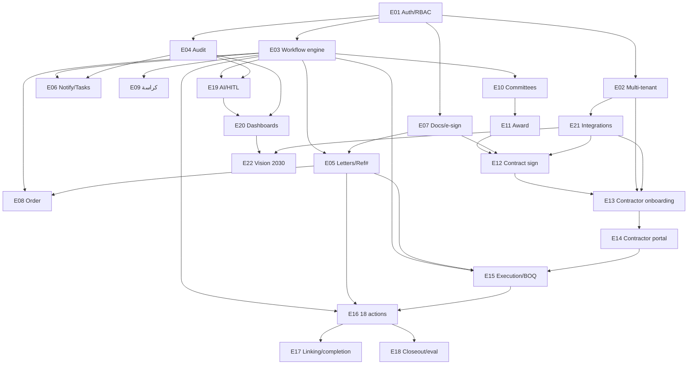

# Tanfeeth — Delivery Backlog (Epics · Stories · Tasks · Dependencies)

> Status: living document, v0.1 (2026-06-07). This is the **delivery view** of the
> product: it breaks the domain into epics, user stories, technical tasks, subtasks,
> dependencies, and a phased sequence. It is **not** a second source of truth for the
> domain — the domain authority remains [`PRODUCT.en.md`](./PRODUCT.en.md) /
> [`PRODUCT.ar.md`](./PRODUCT.ar.md) and the binding [`RULES.md`](./RULES.md). Where this
> backlog introduces behaviour not yet in `PRODUCT`, it is tagged **`[NEW → ratify in PRODUCT]`**
> and collected in [§12](#12-proposed-additions-to-product-r-14). Every item ties to a
> requirement ID (`FR-*`) and the rules it must honour (`R-*`) per **R-14 / R-15**.
>
> This revision folds in the **"Tanfeeth vs Etimad" stakeholder call** (positioning,
> contractor-as-user, the contract-execution action set, the delay→withdrawal→completion
> scenario, and contract linking).

---

## 0. How to read this document

### 0.1 Hierarchy & ID scheme
```
Track            A grouping of epics (Foundations, Lifecycle, Execution, …)
Epic    E##      A shippable capability. Has a goal, owners, deps, phase, status.
Story   E##.S#   A user-facing increment ("As a <role>, I want … so that …") + acceptance criteria.
Task    E##.T#   A technical unit of work delivering part of one or more stories.
Subtask E##.T#.# A concrete step inside a task.
```
References like `dep: E03, E05.T2` mean "blocked until that epic/task is done."

### 0.2 Legends
- **Status** — `Done` (in a submodule today) · `Partial` (foundation exists, incomplete) · `Planned` (not started).
- **Phase** — `MVP` (first usable slice) · `P2` (second wave) · `P3` (later / Vision-2030 & advanced AI).
- **Size** — `S` (≤2d) · `M` (≤1w) · `L` (≤2w) · `XL` (epic-sized, split before sprinting).
- **Layer** — `BE` backend (NestJS, hexagonal) · `FE` frontend (Next.js) · `INT` integration · `AI` AI layer · `DEVOPS` deploy/infra · `DOC` documentation.

### 0.3 Definition of Done (applies to every story unless overridden) — see **R-16**
A story is **Done** only when:
1. The state change is a **gated, permission-checked transition** in the workflow engine (R-01, R-04, R-05) — never a side path.
2. Every action writes an **immutable audit entry** (actor, timestamp, before→after) (R-02).
3. Any **AI output with financial / contractual / regulatory impact** is gated behind explicit human review + approval and ships with explainability (R-03).
4. All user-facing strings exist in **both** `ar` + `en` message bundles; layout is **RTL-correct**; Hijri+Gregorian + SAR where dates/money appear (R-12).
5. Tenant scoping is enforced on every query/file/audit row (R-11); nothing leaks cross-tenant.
6. The gated path is **exercised end-to-end and observed** (not "it compiles") (R-16) — unit + e2e where transitions/permissions/audit are involved.
7. Thresholds / chains / templates are read from the **configurable engine**, not hard-coded (R-13).

---

## 1. Positioning — Tanfeeth complements Etimad (it does not replace it)

Tanfeeth is the **internal operating system** a government entity wraps around Etimad. It
automates the entity's *internal* work **before / during / after** the Etimad-facing stages,
then owns the **entire post-signature contract & project execution** that Etimad does not cover.

| Boundary | **Etimad (اعتماد)** owns | **Tanfeeth (تنفيذ)** owns |
|---|---|---|
| Pre-award | Publishing the competition (طرح المنافسات), receiving offers (استقبال العروض), award (الترسية), and **usually** contract signature (توقيع العقد) | Internal order management, building the كراسة & requirements, running committees & approvals, **internal** upload & analysis of offers |
| Signature | Often the signing surface (Scenario A) | Reflecting the signed contract, or producing it when signed outside Etimad (Scenario B) |
| **Post-award (the gap)** | — | **Contract management after signing, contractor follow-up, reports, warnings (إنذارات), payments (مستخلصات), amendments (تعديلات), and acceptance (استلام)** |

> One-paragraph framing (from the call): *Tanfeeth is not just a dashboard — it is a full
> operating system for managing government contracts internally. It connects the entity to the
> contractor, the committees, the departments, and the oversight bodies, and turns today's manual
> work into an automated, AI-assisted workflow.*

This boundary is the reason Track C (Execution) is the centre of gravity of this backlog.

---

## 2. Domain primer the backlog assumes

These concepts are used throughout. The first two refine `PRODUCT`; items tagged `[NEW]` are
collected for ratification in §12.

- **Project vs Contract.**
  - *Project (مشروع)* = the works to be delivered (e.g. *build a hospital*).
  - *Contract (عقد)* = the signed instrument that governs the project's execution.
  - **Project execution begins inside Tanfeeth only after the contract is signed.** A project
    may relate to one or more contracts over its life (e.g. an original + a completion contract).
- **Contractor is a first-class user.** `[NEW → ratify]` After signature, a Contracts-dept
  employee **invites** the contractor to register in Tanfeeth; the account is **bound to the
  Commercial Registration (CR/السجل التجاري) and the contract**. The contractor authenticates
  (Nafath/business identity) and acts only on their own contracts (tenant + contract scoped).
- **Contract linking & completion-of-works contracts.** `[NEW → ratify]` Contracts can be
  **linked**. When works are withdrawn (سحب الأعمال), Tanfeeth spawns a **completion-of-works
  contract (عقد استكمال أعمال)** linked to the original, carrying over the *remaining* BOQ scope.
- **Execution actions are gated transitions, not free-form buttons.** Each of the ~18 actions
  in [§9](#9-contract-execution-actions--master-table) is a workflow transition (R-01/R-05) that
  usually emits an **official letter** needing a **reference number** (R-09), is **audited**
  (R-02), and may be **AI-suggested under HITL** (R-03).

---

## 3. Actors → canonical roles (reconciliation)

The call named the actors below. To honour **R-15 (one domain model)** we map them to the
canonical RBAC roles in `PRODUCT` §3 rather than inventing parallel roles. Items tagged
`[NEW]` are proposed additions (see §12).

| Call actor (AR) | Canonical mapping | Notes |
|---|---|---|
| الجهة الحكومية | **Tenant / entity** | The multi-tenant boundary (R-11), not a user role. |
| إدارة العقود والمشتريات | **Contract Dept Manager (CDM) + Contract Dept Staff** | Operational core; CDM default access (R-04). |
| الإدارة المالية | **Financial Manager / Budget Head** | Budget confirm + BR-01 split + final commitment. |
| الإدارة المشرفة | **Requester/Owning Dept** *in its execution-supervision capacity* `[NEW: clarify]` | Supervises the contractor during execution; initiates commencement/acceptance, verifies contractor responses. |
| المقاول | **Contractor (External)** | Now a provisioned platform user (E13/E14). |
| الإدارة العليا | **Higher Management** | Final approval, signature, escalation, delegation. |
| الجهات الرقابية | **Oversight / Regulatory persona** `[NEW → ratify]` | Read-only + audit access; consumes compliance dashboards & immutable logs. |
| Super Admin / Super User | **Platform/Tenant Admin** `[NEW → ratify]` | Already partly present (admin-portal: roles/permissions/users). Tenant provisioning + engine config. |

---

## 4. Epic index (the whole product)

Tracks A/B/D/E are largely specified in `PRODUCT`; **Track C is where the call adds the most**.
Status reflects the two submodules as inspected on 2026-06-07 and is *indicative* — confirm
against the code before sprinting.

| Epic | Name | Track | FR refs | Depends on | Phase | Status |
|---|---|---|---|---|---|---|
| **E01** | Identity, Auth & RBAC | A Foundations | RBAC | — | MVP | **Done** |
| **E02** | Multi-tenancy & data residency | A Foundations | NFR, R-10/11 | E01 | MVP | Partial |
| **E03** | Configurable workflow & business-rules engine | A Foundations | FR-WF, R-01/05/06/07/13 | E01 | MVP | Partial |
| **E04** | Immutable audit & activity log | A Foundations | R-02, NFR | E01 | MVP | Partial |
| **E05** | Correspondence, letter generation & reference numbers | A Foundations | FR-FT, FR-CM, R-09, INT-09 | E03, E07 | MVP | Planned |
| **E06** | Notifications & task / deadline center | A Foundations | FR-FT, INT-08 | E03, E04 | MVP | Planned |
| **E07** | Documents, files & e-signature | A Foundations | FR-FT, INT-06 | E01 | MVP | Partial |
| **E08** | Order creation & approval (Stage 1) | B Pre-award | FR-WF-001…009 | E03, E05 | MVP | Planned |
| **E09** | Bid document / كراسة preparation (Stage 2) | B Pre-award | FR-WF-006…012 | E03, E07, E08 | MVP | Planned |
| **E10** | Committees: pre-qual, opening, evaluation (St. 3,5,6,7) | B Pre-award | FR-WF-008…023 | E03, E10-INT | P2 | Planned |
| **E11** | Announcement, award & letter of intent (St. 4,8) | B Pre-award | FR-WF-013…031 | E10, E21 | P2 | Planned |
| **E12** | Contract drafting & signature (Stage 9) | B Pre-award | FR-WF-029…033 | E07, E11, E21 | P2 | Planned |
| **E13** | Contractor onboarding & invitation | C Execution | FR-CT (+new) | E01, E02, E12, E21 | MVP | Planned |
| **E14** | Contractor portal | C Execution | FR-CT-001…005 | E13, E14-deps | MVP | Planned |
| **E15** | Project execution & commencement (Stage 10, BR-02) | C Execution | FR-WF-034…039 | E03, E05, E14 | MVP | Planned |
| **E16** | Contract lifecycle actions (the 18 actions) | C Execution | FR-EX (+new) | E03, E05, E15 | MVP→P2 | Partial |
| **E17** | Contract linking & completion-of-works contracts | C Execution | FR-EX (+new) | E16 | P2 | Planned |
| **E18** | Closeout & contractor evaluation | C Execution | FR-EX-007…011 | E16 | P2 | Planned |
| **E19** | AI layer & HITL platform | D Intelligence | FR-AI-001…016, R-03 | E03, E04 | MVP→P3 | Partial |
| **E20** | Dashboards & reporting | D Intelligence | FR-FT/CM/HM | E04, E19 | MVP→P2 | Partial |
| **E21** | National integrations | E Integrations | INT-01…09, R-08 | E02 | P2 | Planned |
| **E22** | Vision 2030 & localization | E Integrations | FR-V30-001…010 | E20, E21 | P3 | Planned |

---

# Track A — Platform foundations

> Everything else stands on these. They are the highest-priority dependencies.

## E01 — Identity, Auth & RBAC  · `Done`
**Goal:** Stateless JWT access + rotating hashed refresh tokens; permission-based authorization
with runtime-created roles; admin portal for users/roles/permissions.
**Owners:** Platform Admin. **FR:** RBAC. **Rules:** R-04. **Phase:** MVP. **Status:** Done
(backend `auth`/`rbac`/`access-control`/`users`; frontend `admin-portal` + `features/auth`).

**Stories**
- **E01.S1** *As a user, I sign in and receive a short-lived access token and a rotating refresh token, so my session is secure.* — Done.
- **E01.S2** *As a platform admin, I create roles at runtime and assign permission keys (`resource.action`), so access matches the org.* — Done.
- **E01.S3** *As any caller, my route access is the union of my roles' permission keys, enforced by `@Auth(...)`.* — Done.

**Remaining tasks (hardening)**
- **E01.T1** `BE/S` Confirm CDM default-access rule (R-04) is expressible as a permission/policy, not bespoke code. *dep: E03.*
- **E01.T2** `BE/S` Add `oversight` (read+audit) and `contractor` permission bundles to the seed catalog. *dep: E13.*
- **E01.T3** `DEVOPS/S` Rotate the seeded admin password on first boot (carry-over security follow-up).

---

## E02 — Multi-tenancy & data residency  · `Partial`
**Goal:** Every query, file, and audit row scoped to its entity (tenant); KSA hosting; encryption.
**FR:** NFR. **Rules:** R-10, R-11. **Deps:** E01. **Phase:** MVP.

**Stories**
- **E02.S1** *As the platform, I scope all data to a tenant so no entity can read another's data.*
  - **AC:** a tenant id is resolved per request from the principal; repositories filter by it; an attempt to read another tenant's row returns 404/empty, never data; covered by an e2e cross-tenant test.
- **E02.S2** *As a compliance owner, I can prove data is hosted in KSA and encrypted at rest/in transit.*
  - **AC:** infra docs + config show in-region hosting; TLS enforced; DB/disk encryption on; secrets never logged (R-10).

**Tasks**
- **E02.T1** `BE/L` Introduce a tenant context (request-scoped) + a base repository filter; audit one module end-to-end. *dep: E01.* Subtasks: T1.1 tenant resolution from JWT claims; T1.2 query filter mixin; T1.3 file-path namespacing; T1.4 cross-tenant e2e test.
- **E02.T2** `DEVOPS/M` Document & verify in-region hosting, at-rest encryption, TLS, backup residency (NCA/CST). *dep: deploy stack.*
- **E02.T3** `BE/S` Tenant-scope the audit log + storage keys. *dep: E04, E07.*

---

## E03 — Configurable workflow & business-rules engine  · `Partial`  ⭐ central dependency
**Goal:** A single engine that defines **states, role-/rule-gated transitions, standard actions,
approval chains, and configurable thresholds** — reused by every lifecycle and execution flow
(no parallel flows). **FR:** FR-WF. **Rules:** R-01, R-05, R-06, R-07, R-13, R-15. **Deps:** E01.
**Phase:** MVP. **Status:** Partial — a contract workflow slice exists (`contracts`:
`contract-workflow.ts`, `advance-contract-workflow.use-case.ts`, `contract-workflow-state.*`).

**Stories**
- **E03.S1** *As an engineer, I define a workflow as states + transitions, each transition owning
  the role(s) and business rules that gate it, so no state changes by a side path.*
  - **AC:** a transition is rejected if (a) the actor lacks the permission, or (b) a gate rule fails; both produce a typed `DomainError`; success writes an audit entry (R-02). Standard action set = **Confirm, Reject, Return-with-comment, Edit, Assign, Comment, Sign** (R-05) — no bespoke per-screen verbs.
- **E03.S2** *As a config admin, I set thresholds and approval chains (e.g. the 5M doc-split, who signs what) without code changes.*
  - **AC:** BR-01 threshold (R-06) and BR-02 branch (R-07) read from config; changing the threshold changes behaviour with no deploy.
- **E03.S3** *As the CDM, I am the default owner of every action on my department's orders, and Assignment transfers the action permission to staff while my access remains (R-04).*
  - **AC:** assign moves the action permission; CDM can still act; both paths audited.

**Tasks**
- **E03.T1** `BE/L` Generalize the contract workflow slice into a reusable engine (state registry, transition guards = permission check + rule predicate, action verbs). *dep: E01.* Subtasks: T1.1 transition definition model; T1.2 guard pipeline (perm → rules → effect → audit); T1.3 standard-action catalog; T1.4 `DomainError` codes registered in `domain-exception.filter.ts`.
- **E03.T2** `BE/M` Business-rules config store: BR-01 (5M split, configurable), BR-02 (supply/maintenance branch), approval-chain definitions. *dep: T1.*
- **E03.T3** `BE/M` Assignment/delegation primitive honouring R-04 (CDM default access + action transfer). *dep: T1, E01.*
- **E03.T4** `BE/M` Workflow read API + per-stage "available actions for me" resolver (drives FE buttons). *dep: T1.*
- **E03.T5** `FE/M` Generic workflow UI: state timeline, available-actions bar, return-with-comment modal, assignment picker — i18n/RTL. *dep: T4.*
- **E03.T6** `BE/S` e2e: full gated transition with permission + rule + audit (R-16). *dep: T1–T3.*

---

## E04 — Immutable audit & activity log  · `Partial`
**Goal:** Append-only record of every transition and impactful action (actor, time, before→after).
**FR:** NFR. **Rules:** R-02. **Deps:** E01. **Phase:** MVP.

**Stories**
- **E04.S1** *As an oversight user, I can see an immutable, filterable history of every change to a contract/order.*
  - **AC:** entries are append-only (no update/delete API); each carries actor, tenant, entity ref, action, before/after snapshot, timestamp (Hijri+Gregorian display); export to the reports engine (E20).

**Tasks**
- **E04.T1** `BE/M` Audit port + append-only store; written from the engine's effect step (E03.T1.2). *dep: E03.T1.*
- **E04.T2** `BE/S` Tamper-evidence (hash chain / write-once storage) — design spike. *dep: T1.*
- **E04.T3** `FE/M` Activity-log timeline component (per contract/order), filter by actor/action/date. *dep: T1.*

---

## E05 — Correspondence, letter generation & reference numbers  · `Planned`
**Goal:** Generate official letters from templates + clause library, route for signature, and
obtain an **official reference number & date** via the Incoming/Outgoing integration before any
external letter leaves the entity. **FR:** FR-FT (correspondence), FR-CM (templates/clauses).
**Rules:** R-09, R-12. **Deps:** E03, E07. **Phase:** MVP. *This epic is a hard dependency of
every execution action in E16.*

**Stories**
- **E05.S1** *As Contract staff, I generate a letter (commencement, warning, dues, …) from a
  dynamic template with merged contract data, so I don't draft from scratch.*
  - **AC:** template + clause library; AR/EN; merge fields validated; output PDF/Word; draft is audited; AI may pre-fill but a human edits/approves (R-03).
- **E05.S2** *As the Incoming/Outgoing dept, every external letter obtains a reference number & date before it is sent (R-09).*
  - **AC:** no external letter can reach "sent" without a reference; the number+date are stamped on the document and stored on the action; attempt to skip is blocked by the gate.
- **E05.S3** *As a recipient department/contractor, I receive the letter in-platform (and via email/WhatsApp) with its reference.*

**Tasks**
- **E05.T1** `BE/L` Letter template engine + clause library (versioned). Subtasks: T1.1 template model + merge fields; T1.2 clause library; T1.3 PDF/Word render (reuse reports renderer); T1.4 bilingual templates.
- **E05.T2** `INT/M` Incoming/Outgoing reference-number integration (issue number+date). *dep: E21 pattern.* `[NEW → confirm system]`.
- **E05.T3** `BE/M` Reference-number gate: a transition that emits an external letter cannot complete without a reference (R-09). *dep: E03, T2.*
- **E05.T4** `FE/M` Letter composer + preview + sign/route UI; reference badge. *dep: T1, E03.T5.*
- **E05.T5** `AI/M` AI letter pre-fill with explainability + mandatory human edit/approve (R-03). *dep: E19.*

---

## E06 — Notifications & task / deadline center  · `Planned`
**Goal:** Notification center + a task center with reminders, deadlines, efficiency tracking, and
"AI acting on the user's behalf" within HITL bounds. **FR:** FR-FT (productivity/tasks). **INT:**
INT-08 (WhatsApp). **Deps:** E03, E04. **Phase:** MVP (in-app) → P2 (WhatsApp/AI agent).

**Stories**
- **E06.S1** *As any user, I see my pending actions, deadlines, and reminders in one place, so nothing slips.*
  - **AC:** tasks derive from open transitions assigned to me/my role; due dates; overdue flag; links to the action.
- **E06.S2** *As a manager, I see per-member deadlines + efficiency rate.* (feeds E20).
- **E06.S3** *As a user, the AI can draft/queue routine actions on my behalf, but impactful ones require my approval (R-03).*

**Tasks**
- **E06.T1** `BE/M` Notification model + fan-out (in-app); subscription to engine events. *dep: E03.*
- **E06.T2** `BE/M` Task center: derive tasks from open/assigned transitions + deadlines. *dep: E03.*
- **E06.T3** `INT/M` WhatsApp BSP (HSM templates, opt-in/out) + email channel. *dep: E21.*
- **E06.T4** `FE/M` Notification center + task center UI (i18n/RTL). *dep: T1,T2.*
- **E06.T5** `AI/L` "AI acts on my behalf" queue with HITL approval. *dep: E19.* `P2`.

---

## E07 — Documents, files & e-signature  · `Partial`
**Goal:** Document/file management (project files by stage, document status center) + e-signature
for contracts/letters. **FR:** FR-FT. **INT:** INT-06 (DocuSign/Adobe Sign). **Deps:** E01.
**Phase:** MVP. **Status:** Partial — `storage` module + `features/files` exist.

**Stories**
- **E07.S1** *As staff, I attach/organize documents per project and per lifecycle stage with a status center, so I can see what's missing.*
- **E07.S2** *As a signer (CDM/Higher Mgmt/Contractor), I sign contracts/letters electronically with a verifiable trail.*

**Tasks**
- **E07.T1** `BE/M` Project files model (by stage) + document status center. *dep: E07 storage.*
- **E07.T2** `INT/L` E-signature integration (provider abstraction). *dep: E21.* Subtasks: provider port; envelope create; webhook on signed; store signed artifact + audit.
- **E07.T3** `FE/M` Document center UI (status, by stage, upload, version). *dep: T1.*

---

# Track B — Pre-award competition lifecycle (Stages 1–9)

> Fully specified in `PRODUCT` §4 (scenarios + user stories + options). Here we record the
> delivery breakdown only; **do not duplicate the scenarios — reference `PRODUCT`**.

## E08 — Order creation & approval (Stage 1)  · `Planned`
**Goal:** Requester→Head→Finance(+BR-01)→PMO/Cyber/Local-Content→Higher Mgmt→CDM.
**FR:** FR-WF-001…009. **Rules:** R-01/02/05/06. **Deps:** E03, E05. **Phase:** MVP.

**Stories** (see `PRODUCT` §4 Stage 1 for full scenarios)
- **E08.S1** *As a requester, I create & submit a project order (fields, brief, documents).* `FR-WF-001`.
- **E08.S2** *As Budget Head, when I set the budget I apply the 5M rule (BR-01) to split/merge tech+financial docs.* `FR-WF`, R-06.
- **E08.S3** *As any approver, I Confirm / Reject / Return-with-comment / Edit / Assign.* R-05.

**Tasks:** E08.T1 `BE/L` order domain + Stage-1 transitions on the engine (dep E03); E08.T2 `BE/M`
BR-01 hook at budget set (dep E03.T2); E08.T3 `BE/M` optional PMO/Cyber/Local-content gates (config);
E08.T4 `FE/L` order create/edit + approval UI; E08.T5 `BE/S` e2e happy + return + reject (R-16).

## E09 — Bid document / كراسة preparation (Stage 2)  · `Planned`
**FR:** FR-WF-006…012. **Deps:** E03, E07, E08. **Phase:** MVP.
- **E09.S1** *As CDM, I create the كراسة and assign to staff while retaining oversight (R-04).*
- **E09.S2** *As staff, I draft the كراسة (PDF/Word) and return to CDM.*
- **Tasks:** BE assignment transfer (dep E03.T3); FE كراسة builder + assign; doc output via E05/E07.

## E10 — Committees: pre-qual, opening, evaluation (Stages 3,5,6,7)  · `Planned`
**FR:** FR-WF-008…023. **Deps:** E03, E21 (Etimad). **Phase:** P2.
- **E10.S1** *As a committee secretary, I run pre-qualification (launch announcement in Etimad, consolidate scores).* `FR-WF-008…012`.
- **E10.S2** *As a bid-opening coordinator, I upload signed opening minutes + offers received from Etimad.* `FR-WF-013…017`.
- **E10.S3** *As a technical evaluator, I score offers; AI suggests scores with explanations but the committee decides (R-03).* `FR-WF-018…022`.
- **E10.S4** *As the platform, I check mandatory-list / local-content / SME flags and (financial) BOQ prices + lowest-offer comparison.* `FR-WF-023`.
- **Tasks:** committees tab (dashboard per committee); scoring model + reports; Etimad offer pull (dep E21); BOQ price-check service (shared with E15). *Pre-qual skippable per config (R-13).*

## E11 — Announcement, award & letter of intent (Stages 4,8)  · `Planned`
**FR:** FR-WF-013…031. **Deps:** E10, E21. **Phase:** P2.
- **E11.S1** *As staff, I publish the announcement with details from Etimad.*
- **E11.S2** *As CDM/committee, I produce the awarding letter, sign the letter of intent, run post-qualification.*
- **E11.S3** *As Budget Head, I confirm the final budget commitment before award approval.*
- **E11.S4** *As Incoming/Outgoing, the award gets a reference number (R-09).* *(award rejectable with reasons — option).*

## E12 — Contract drafting & signature (Stage 9)  · `Planned`
**FR:** FR-WF-029…033. **Deps:** E07, E11, E21. **Phase:** P2.
- **E12.S1 (Scenario A)** *Signed in Etimad → staff upload contract data (PDF) and reflect it in Tanfeeth (R-08).*
- **E12.S2 (Scenario B)** *Signed outside Etimad → staff create contract data from approved drafts; CDM confirms.*
- **E12.S3** *Legal review → remarks → CDM confirm → Budget Head final commitment → contractor reviews milestones → Higher Mgmt signs → Contractor signs (e-sign, E07.T2).*
- *Note:* an additional signing scenario is pending stakeholder discussion (see §11).

---

# Track C — Contract & project execution  ⭐ (centre of gravity of the call)

> This is the gap Etimad leaves and Tanfeeth fills. Several behaviours here are **`[NEW → ratify
> in PRODUCT]`** (collected in §12). Build order: **E13 → E14 → E15 → E16 → E17 → E18**.

## E13 — Contractor onboarding & invitation  · `Planned`  `[NEW → ratify]`
**Goal:** After signature, a Contracts employee invites the contractor to register; the account is
bound to the **Commercial Registration (CR)** and the **contract**; the contractor authenticates
and is scoped to their own contracts only. **FR:** FR-CT (+ proposed `FR-CT-006…010`). **Rules:**
R-04, R-08 (Nafath/CR as source of truth), R-10, R-11. **Deps:** E01, E02, E12, E21. **Phase:** MVP.

**Stories**
- **E13.S1** *As a Contracts employee, after the contract is signed I send the contractor an
  invitation to register in Tanfeeth, so they can be followed up inside the platform.*
  - **AC:** invite is generated only for a signed contract; carries a single-use, expiring token; is audited; resend/revoke supported; invite delivered via email/WhatsApp (E06).
- **E13.S2** *As a contractor, I accept the invitation and register, and my account is linked to my
  CR and the specific contract.*
  - **AC:** identity verified (Nafath / business identity, R-08); CR validated; account bound to contract + tenant; contractor sees **only** their contracts (R-11); GOSI compliance check available (INT-04).
- **E13.S3** *As a contractor with multiple contracts, additional contracts attach to my existing
  account rather than creating duplicates.*
  - **AC:** dedupe by CR/identity; new contract appears under the same account.
- **E13.S4** *As a Contracts employee, I can manage the contractor's representative (link to the
  "contract representative delegation" action, E16).*

**Tasks**
- **E13.T1** `BE/L` Contractor account model bound to CR + contract; tenant + contract scoping. Subtasks: T1.1 CR field + validation; T1.2 contract↔contractor link; T1.3 scoping guard; T1.4 dedupe by CR.
- **E13.T2** `BE/M` Invitation domain: issue (signed-contract gate), single-use expiring token, accept, resend, revoke, audit. *dep: E12, E03.*
- **E13.T3** `INT/M` Identity verification (Nafath/business) + GOSI check at onboarding. *dep: E21.*
- **E13.T4** `BE/S` Contractor permission bundle (own-contract actions only) added to seed (E01.T2).
- **E13.T5** `FE/M` Employee "invite contractor" flow + status; contractor registration/accept flow (i18n/RTL).
- **E13.T6** `BE/S` e2e: invite → accept → contractor sees only their contract; cross-contract access denied (R-16, R-11).

## E14 — Contractor portal  · `Planned`
**Goal:** The external contractor's home: project details/timeline/performance, contract section
(sign/review/download/share), request initiation (extension, value change), updates window
(progress + media), meetings (minutes/recording/summary). **FR:** FR-CT-001…005. **Deps:** E13,
E07, E05, E15, E16. **Phase:** MVP (read + respond) → P2 (meetings/media).

**Stories**
- **E14.S1** *As a contractor, I see my project(s): details, timeline, my performance, what's due.*
- **E14.S2** *As a contractor, I review/sign/download/share my contract.* *(e-sign via E07.T2).*
- **E14.S3** *As a contractor, I initiate a request (extension / value change) that enters the
  entity's gated workflow (links to E16 variation/extension).*
- **E14.S4** *As a contractor, I submit progress updates (text + images/video) against milestones/BOQ.*
- **E14.S5** *As a contractor, I respond in-platform to a warning/dues/notice letter, so my response
  is on record before escalation.* (critical for the §10 scenario.)
- **E14.S6** *As a contractor, I hold/record meetings with minutes, recording, and AI summary.* `P2`.

**Tasks:** E14.T1 `FE/L` contractor dashboard + project/timeline/perf; E14.T2 `FE/M` contract
section (review/sign/download/share, dep E07); E14.T3 `BE+FE/M` contractor-initiated requests →
engine (dep E16); E14.T4 `BE+FE/M` updates window vs milestones/BOQ (dep E15); E14.T5 `BE+FE/M`
**in-platform response to letters** (dep E05, E16) — *required by §10 scenario*; E14.T6 `FE/L`
meetings (minutes/recording/AI summary, dep E19) `P2`.

## E15 — Project execution & commencement (Stage 10, BR-02)  · `Planned`
**Goal:** Start the project after signature and run it: commencement (Supply vs Maintenance per
BR-02), site handover, the **Project Execution Dashboard**, **BOQ / جدول الكميات** tracking,
milestones/progress, and payments/**مستخلصات**. **FR:** FR-WF-034…039, FR-FT (payment plan/BOQ).
**Rules:** R-07 (BR-02), R-01/02/09. **Deps:** E03, E05, E14. **Phase:** MVP.

**Stories**
- **E15.S1 (BR-02 Supply)** *As a requester/supervising dept, I initiate commencement → CDM
  confirms → staff issue the commencement letter → CDM signs → reference number → emailed →
  contractor receives.* `FR-WF-034…039`, R-07.
- **E15.S2 (BR-02 Maintenance)** *Same, plus a **site-handover minute** signed by the site-handover
  committee (member→chair) + cover letter + reference.* R-07.
- **E15.S3** *As staff, I manage the **BOQ** (line items, quantities, unit prices) so progress and
  payments price against it.*
- **E15.S4** *As a supervising dept, I track **milestones/progress** and see schedule vs actual on a
  **Project Execution Dashboard** with delay flags (feeds AI risk E19 + the §10 scenario).*
- **E15.S5** *As finance/CDM, I manage **payments (مستخلصات)** against the BOQ and MoF budget
  availability, each gated + audited.*

**Tasks**
- **E15.T1** `BE/M` Commencement transitions with BR-02 branch (supply vs maintenance) on the engine. *dep: E03.T2, E05.*
- **E15.T2** `BE/L` BOQ model (line items, qty, unit price, measured/remaining). Subtasks: import (reuse smart-import); validation; remaining-quantity tracking (feeds E17 carry-over).
- **E15.T3** `BE/M` Milestones/progress model + schedule-vs-actual + delay computation. *dep: E15.T2.*
- **E15.T4** `BE/M` Payments/مستخلصات against BOQ + MoF availability; gated + audited. *dep: E15.T2, E21(MoF).*
- **E15.T5** `FE/L` **Project Execution Dashboard** (timeline, milestones, BOQ progress, delay flags, payments) — i18n/RTL, no generic flat admin cards (design.md).
- **E15.T6** `FE/M` Commencement + site-handover flows UI. *dep: E15.T1.*
- **E15.T7** `BE/S` e2e: supply commencement + maintenance commencement w/ committee (R-16).

## E16 — Contract lifecycle actions (the 18 actions)  · `Partial`  `[NEW → ratify the action set]`
**Goal:** Implement the canonical **execution action set** from the call as gated transitions, each
emitting an official letter (E05) with a reference number (R-09), audited (R-02), AI-suggestable
under HITL (R-03), and updating contract/project state (and guarantees/finance where relevant).
**FR:** FR-EX (+ proposed extensions). **Rules:** R-01/02/03/05/09/13. **Deps:** E03, E05, E15.
**Phase:** MVP (notice/warning/final-warning/withdrawal/variation/extension/suspension/resumption)
→ P2 (dues/assignment/labor/acceptance/termination/guarantees/rep-delegation). **Status:** Partial
— a generic contract workflow + an AI Next-Best-Action lifecycle slice (expired→final-acceptance)
already exist; this epic generalizes them to the full action set.

> The 18 actions, their triggers, owners, approval chains, outputs, and state effects are tabulated
> in **[§9](#9-contract-execution-actions--master-table)**. Each row = one story (`E16.S<n>`) +
> one transition task. The pattern is identical, so they are defined once here and instantiated per
> action.

**Pattern story (instantiated per action)**
- **E16.S\<action\>** *As the \<owning role\>, when \<trigger\>, I issue the \<action\> through the
  gated workflow, which produces the \<official letter/minute\>, obtains a reference number, records
  an audit entry, and transitions the contract/project state — with the AI proposing the action and
  its justification, and a human approving (R-03).*
  - **AC (every action):** permission-gated to the owning role(s); rule-gated (precondition holds);
    letter generated (E05) and, if external, blocked from sending without a reference (R-09);
    audited before→after (R-02); state transition recorded; guarantee/financial side-effects applied
    where the row specifies; AR/EN letter; exercised e2e (R-16).

**Tasks**
- **E16.T1** `BE/L` Action framework on the engine: an "execution action" = trigger + precondition
  rule + owner role(s) + approval chain + letter template ref + state effect + financial/guarantee
  effect + AI-suggestion hook. *dep: E03.T1, E05.*
- **E16.T2** `BE/M` MVP action set (notice to commence, warning, final warning, withdrawal,
  variation/change order, extension, suspension, resumption) as engine config rows. *dep: T1.*
- **E16.T3** `BE/M` P2 action set (dues, assignment/waiver, labor endorsement, preliminary
  acceptance, final acceptance, termination, return initial guarantee, request final guarantee,
  contract-representative delegation). *dep: T1, E18, E13.*
- **E16.T4** `AI/M` AI suggestion + explainability per action under HITL (R-03). *dep: E19.*
- **E16.T5** `FE/M` Action launcher on the contract/project view (available actions per role from
  E03.T4) + letter preview + approve/sign. *dep: E03.T5, E05.T4.*
- **E16.T6** `BE/S` e2e per action group exercising perm+rule+letter+ref+audit+state (R-16).

## E17 — Contract linking & completion-of-works contracts  · `Planned`  `[NEW → ratify]`
**Goal:** Model relationships between contracts and, when works are **withdrawn** (سحب الأعمال),
spawn a **completion-of-works contract (عقد استكمال أعمال)** linked to the original, carrying over
the **remaining BOQ scope**. **FR:** FR-EX (+ proposed). **Rules:** R-01/02/15. **Deps:** E16.
**Phase:** P2.

**Stories**
- **E17.S1** *As CDM, I link a contract to a related contract (e.g. completion, framework parent) and
  see the relationship on both.*
- **E17.S2** *As CDM, when works are withdrawn, the system creates a completion-of-works contract
  linked to the original, pre-filled with the **remaining** BOQ scope, so a new contractor can finish.*
  - **AC:** withdrawal (E16) is a precondition; remaining BOQ (E15.T2) carries over; the new contract
    references the original; both are audited; the original's state reflects "works withdrawn".
- **E17.S3** *As Higher Mgmt/oversight, I can trace the full chain original → completion across
  contracts and contractors.*

**Tasks:** E17.T1 `BE/M` contract relationship model (typed links); E17.T2 `BE/M` withdrawal→
completion spawn with remaining-BOQ carry-over (dep E16, E15.T2); E17.T3 `FE/M` linked-contracts UI +
chain view; E17.T4 `BE/S` e2e withdrawal→completion (R-16).

## E18 — Closeout & contractor evaluation  · `Planned`
**Goal:** Preliminary/final acceptance, guarantee release, and contractor performance evaluation
feeding the supplier reliability index. **FR:** FR-EX-007…011. **Deps:** E16. **Phase:** P2.

**Stories**
- **E18.S1** *As a requester, I initiate the **preliminary acceptance** certificate / site-handover
  report; the committee reviews/signs; Higher Mgmt approves or rejects with comment.* `FR-EX-007…009`.
- **E18.S2** *As the entity, on **final acceptance** I release the final guarantee and close the contract.*
- **E18.S3** *As a requester, I **evaluate the contractor**; Head reviews/confirms; Higher Mgmt
  approves → feeds the supplier reliability index (E20).* `FR-EX-010…011`.

**Tasks:** acceptance transitions (dep E16); guarantee release effects; contractor-evaluation form +
scoring → reliability index (dep E20).

---

# Track D — Intelligence & insight

## E19 — AI layer & HITL platform  · `Partial`
**Goal:** The cross-cutting AI layer — **all impactful output gated by HITL with explainability
(R-03)**. Covers Next-Best-Action recommendations, **risk assessment**, compliance/clause scanning,
fraud/collusion/COI detection, smart import (Done), document summarize/chat, and the **HITL approval
surface** every other epic plugs into. **FR:** FR-AI-001…016. **Rules:** R-03. **Deps:** E03, E04.
**Phase:** MVP (NBA + risk + HITL surface) → P3 (fraud/collusion/COI, voice). **Status:** Partial —
AI smart import (analyze→commit) shipped; an AI Next-Best-Action lifecycle slice exists.

**Stories**
- **E19.S1 (HITL surface)** *As any approver, every AI suggestion arrives with its **explanation**
  and an explicit **approve / edit / reject**, and nothing impactful executes without my approval.*
  - **AC:** a reusable "AI suggestion" object (recommendation + rationale + confidence + sources) with
    a mandatory human decision recorded in the audit log (R-02, R-03).
- **E19.S2 (Next-Best-Action)** *As a user, the system recommends the next action on a contract/order
  with justification (e.g. "delay detected → suggest warning letter").* — feeds E16 + the §10 scenario.
- **E19.S3 (Risk assessment)** *As Higher Mgmt/CDM, I see AI risk scores (delay, financial, compliance)
  with drivers, feeding the risk heatmap (E20).*
- **E19.S4 (Compliance)** *As the platform, AI scans contracts/letters for missing mandatory clauses &
  deviations and alerts (HITL).*
- **E19.S5 (Knowledge/assistant)** *As a user, I ask the assistant about internal rules & the tenders
  law and get per-contract analysis/summaries.*
- **E19.S6 (Fraud/collusion/COI)** `P3` *bid-collusion (timing/pricing similarity), financial anomaly,
  conflict-of-interest alerts — all advisory under HITL.*

**Tasks:** E19.T1 `BE/M` AI-suggestion domain (recommendation+rationale+confidence+sources) + HITL
decision + audit (dep E04); E19.T2 `AI/M` NBA engine over contract/project state (dep E03, E15); E19.T3
`AI/L` risk scoring service (delay/financial/compliance) (dep E15); E19.T4 `AI/L` clause/compliance
scanner (dep E05/E12); E19.T5 `AI/M` assistant/RAG over rules+law+contract; E19.T6 `AI/XL` fraud/
collusion/COI `P3`; E19.T7 `BE/S` rate-limit + per-tenant **AI opt-in flag** (carry-over from smart
import). *(Reuses the existing OpenAI integration.)*

## E20 — Dashboards & reporting  · `Partial`
**Goal:** Persona dashboards (end user, contracts dept/CDM, Higher Mgmt executive, contractor,
oversight) + report generator/executive summary/compliance dashboard/supplier reliability index/risk
heatmap. **FR:** FR-FT, FR-CM-001…010, FR-HM-001…010. **Deps:** E04, E19. **Phase:** MVP (CDM + exec
basics, reports) → P2 (full HM module). **Status:** Partial — backend reports engine (PDF/Excel, 5
report types) + frontend `generated-reports`/`portal/reports` shipped.

**Stories**
- **E20.S1** *As CDM, my dashboard shows dept performance vs objectives, contracts summary
  (active/nearing-expiry with **color-coded alerts**/pending/completed), repository w/ search,
  lifecycle tracker.* `FR-CM`.
- **E20.S2** *As Higher Mgmt, my strategic dashboard shows competitions, ongoing projects, financial
  commitments, supplier performance, compliance, **risk heatmap**, **supplier reliability index**, and
  decision-support summaries.* `FR-HM`.
- **E20.S3** *As an end user, my dashboard shows my projects, pending requests, document status, timeline.*
- **E20.S4** *As an oversight user, I see the compliance dashboard + immutable audit (E04).* `[NEW persona]`.
- **E20.S5** *As any manager, I generate reports (PDF/Excel/CSV) and an executive summary.* — Done (extend coverage).

**Tasks:** E20.T1 `FE/L` CDM dashboard (dep E15/E16/E04); E20.T2 `FE/L` Higher-Mgmt strategic dashboard
+ risk heatmap (dep E19); E20.T3 `FE/M` end-user dashboard; E20.T4 `FE/M` oversight/compliance view (dep
E04); E20.T5 `BE/M` extend report generator coverage + executive summary; E20.T6 `BE/M` supplier
reliability index aggregation (dep E18). *(Defer prod migration of the reports module — carry-over.)*

---

# Track E — Integrations & compliance

## E21 — National integrations  · `Planned`  ⭐ enables Tracks B/C
**Goal:** Etimad, Nafath, MoF, GOSI, MISA, e-signature, ERP/CRM, WhatsApp, Monafasat AI — design to
**their** contracts, keep Tanfeeth and Etimad/MoF state in sync, never drift (R-08). **INT:**
INT-01…09. **Rules:** R-08. **Deps:** E02. **Phase:** P2 (some mocked earlier for dev).

| Story | System | Purpose | Crit |
|---|---|---|---|
| E21.S1 | **Etimad** | publish competitions, financial approval, receive offers, payment tracking | Critical |
| E21.S2 | **Nafath** | identity & auth (also contractor onboarding E13) | Critical |
| E21.S3 | **MoF** | budget, bid examination, payment plans | Critical |
| E21.S4 | **GOSI** | supplier compliance verification | High |
| E21.S5 | **MISA** | international suppliers | Medium |
| E21.S6 | **E-signature** | DocuSign/Adobe Sign (E07.T2) | High |
| E21.S7 | **ERP/CRM** | contract & supplier sync | Medium |
| E21.S8 | **WhatsApp BSP** | HSM notifications, opt-in/out (E06.T3) | Medium |
| E21.S9 | **Monafasat AI** | guarantees, generative AI, analytics (E19) | High |

**Tasks:** per-system adapter behind a domain port (R-08); state-sync + reconciliation jobs;
sandbox/mocks for dev; contract tests. *Reference-number issuance (E05.T2) and identity (E13.T3)
are integration sub-deliverables.*

## E22 — Vision 2030 & localization  · `Planned`
**Goal:** Localization dashboard, Saudization/Nitaqat, Zakat/VAT automation, local-content index,
mega-project risk, Arabic NLP, (blockchain transparency — future). **FR:** FR-V30-001…010. **Deps:**
E20, E21. **Phase:** P3. *(Bilingual AR/RTL + Hijri/Gregorian + SAR per R-12 is cross-cutting in the
DoD of every epic — not deferred to here.)*

**Stories:** localization dashboard & supplier localization index; Nitaqat/Saudization & local-content
compliance + non-compliance alerts; Zakat/VAT automation; mega-project (NEOM/Red Sea/Diriyah) risk;
budget-to-2030 alignment; Arabic NLP.

---

## 9. Contract-execution actions — master table

The canonical execution action set from the call. **Each row is one story under E16** (and, where
noted, touches E15/E17/E18). All actions are gated transitions (R-01/R-05), audited (R-02),
AI-suggestable under HITL (R-03), and — when they emit an **external** letter — require a reference
number before sending (R-09). Approval chains are **indicative**; the exact chain is configured in the
engine (R-13) and must be confirmed with stakeholders (§11).

| # | Action (AR / EN) | Trigger | Initiator | Indicative approval chain | Output | Ref# (R-09) | State / financial effect | Phase |
|---|---|---|---|---|---|---|---|---|
| 1 | إشعار بدء الأعمال / Notice to commence | Contract signed; commencement initiated | Supervising dept / CDM | CDM sign → Correspondence | Commencement letter | Yes | Project → *In execution* (BR-02 branch) | MVP |
| 2 | خطاب إنذار / Warning letter | Delay/under-performance detected | Supervising dept (AI-suggested) | Supervising → CDM approve → Correspondence | Warning letter | Yes | Flag *warned*; clock starts | MVP |
| 3 | إنذار نهائي / Final warning | No remedy after warning | Supervising dept | Supervising → CDM → (Higher Mgmt) → Correspondence | Final-warning letter | Yes | Flag *final-warned* | MVP |
| 4 | سحب الأعمال / Withdrawal of works | No remedy after final warning | CDM | CDM → Higher Mgmt approve → Correspondence | Withdrawal letter | Yes | Contract → *works withdrawn*; **triggers E17 completion contract** | MVP |
| 5 | أمر تعديلي / Variation (change order) | Scope/value/duration change | Requester/Contractor | Head → Higher Mgmt → Bid-Exam (MoF) → sign → Correspondence | Change-order letter (+ exam report) | Yes | Adjust value/scope/duration; BOQ delta | MVP (`FR-EX-001…006`) |
| 6 | تمديد عقد / Contract extension | Duration extension request | Requester/Contractor | Head → Higher Mgmt → Correspondence | Extension letter | Yes | Extend end date; guarantee validity check | MVP |
| 7 | إيقاف عمل / Work suspension | Suspension cause | Supervising dept / CDM | CDM → Higher Mgmt → Correspondence | Suspension letter | Yes | Project → *suspended*; pause clock | MVP |
| 8 | استئناف عمل / Work resumption | Cause cleared | Supervising dept / CDM | CDM → Correspondence | Resumption letter | Yes | Project → *in execution*; resume clock | MVP |
| 9 | خطاب مستحقات / Dues (entitlements) letter | Payment/مستخلص due | Finance / CDM | Finance → CDM → Correspondence | Dues letter | Yes | Financial: due against BOQ/MoF | P2 |
| 10 | تنازل / Assignment (waiver/cession) | Contractor assigns rights/dues | Contractor → entity | CDM → Legal → Higher Mgmt → Correspondence | Assignment letter | Yes | Re-route dues/rights | P2 |
| 11 | تأييد عمالة / Labor endorsement | Workforce endorsement needed | Supervising dept / CDM | CDM → Correspondence | Endorsement letter | Yes | Record endorsement | P2 |
| 12 | تسليم موقع / Site handover | Maintenance commencement / closeout | Supervising dept | Site-handover committee (member→chair) → Correspondence | Site-handover minute + cover letter | Yes | Record handover (BR-02) | MVP (maint.) |
| 13 | استلام ابتدائي / Preliminary acceptance | Works substantially complete | Requester | Committee review/sign → Higher Mgmt approve | Preliminary-acceptance certificate | Yes | Contract → *preliminary accepted* | P2 (`FR-EX-007…009`) |
| 14 | استلام نهائي / Final acceptance | Maintenance/warranty period ended | Requester | Committee → Higher Mgmt | Final-acceptance certificate | Yes | Contract → *closed* | P2 |
| 15 | إنهاء عقد / Contract termination | Termination cause | CDM | CDM → Legal → Higher Mgmt → Correspondence | Termination letter | Yes | Contract → *terminated* | P2 |
| 16 | إعادة ضمان ابتدائي / Return initial (bid) guarantee | Award/contract effective | Finance / CDM | Finance → CDM → Correspondence | Guarantee-release letter | Yes | Release initial guarantee | P2 |
| 17 | طلب ضمان نهائي / Request final (performance) guarantee | Before/at contract start | CDM | CDM → Contractor → Finance verify | Guarantee request | Yes | Record performance guarantee | P2 |
| 18 | طلب تفويض ممثل العقد / Contract-representative delegation | Contractor names a representative | Contractor / CDM | CDM approve → Correspondence | Delegation letter | Yes | Bind representative (E13.S4) | P2 |

> Engineering note: every row maps to **the same E16 action framework** (E16.T1) — only the
> precondition rule, owner role(s), chain, letter template, and state/financial effect differ.
> Resist building 18 bespoke flows (R-13, R-15).

---

## 10. Flagship cross-epic scenario — contractor delay → withdrawal → completion contract

This is the scenario from the call. It is the clearest demonstration that Tanfeeth is an operating
system, not a dashboard. It spans **E03, E04, E05, E06, E14, E15, E16, E17, E19, E20**.

| Step | What happens | Epic(s) | Rule(s) |
|---|---|---|---|
| 1 | Project in execution; schedule-vs-actual shows the contractor is **behind** | E15 (dashboard/delay calc) | R-01 |
| 2 | AI **detects the delay** and **recommends a warning letter** with justification | E19 (NBA/risk) + E06 (surfaces as a task) | R-03 |
| 3 | The supervising employee **reviews & approves** the suggestion (HITL) | E16.S(warning) + E19 (HITL) | R-03 |
| 4 | The **warning letter is generated**, obtains a **reference number & date**, and is **issued** | E05 (letter+ref) | R-09, R-02 |
| 5 | The **contractor responds in-platform** within the window | E14.S5 | R-02 |
| 6 | The **supervising dept verifies** the response | E16 (return/confirm) | R-01 |
| 7 | If not remedied → **final warning** (same gated pattern) | E16.S(final-warning) | R-01/02/09 |
| 8 | If the contractor still does not comply → **withdrawal of works** (CDM → Higher Mgmt) | E16.S(withdrawal) | R-01/02/09 |
| 9 | Tanfeeth **spawns a completion-of-works contract linked to the original**, carrying the **remaining BOQ** | E17 + E15 (remaining BOQ) | R-01/02/15 |
| 10 | Every step above is in the **immutable audit log**; dashboards/oversight reflect the new state | E04 + E20 | R-02 |

**Acceptance for the scenario (R-16):** demonstrate the *entire* chain end-to-end on a seeded
contract — each transition permission-gated, each letter referenced, each step audited, the
completion contract correctly linked with the remaining BOQ — before calling the execution track
"done".

---

## 11. Open questions / decisions needed

1. **Additional signing scenario (Stage 9)** — `PRODUCT` §4 notes a third signing scenario pending
   stakeholder discussion. Resolve before finalizing E12.
2. **Approval chains per execution action** — the chains in §9 are indicative. Confirm the exact
   role chain for each of the 18 actions with the entity (configured in the engine, R-13).
3. **Supervising dept (الإدارة المشرفة)** — confirm it equals the requesting/owning dept in an
   execution-supervision capacity, or is a distinct role to add to RBAC (R-15). Affects E13/E15/E16.
4. **Oversight bodies (الجهات الرقابية)** — confirm scope of access (read + audit only?) and whether
   they are per-tenant or cross-tenant regulators. Affects E01/E20.
5. **Super Admin / Super User** — confirm split between *platform* admin (tenant provisioning,
   engine config) and *tenant* admin (roles/users within an entity).
6. **Incoming/Outgoing reference-number system** — which system issues official numbers (E05.T2)?
   Is it an Etimad/MoF service or an entity-internal correspondence system?
7. **Contractor identity** — Nafath for individuals vs business identity for companies; CR validation
   source for E13.
8. **Guarantees model** — initial (bid) vs final (performance) guarantee lifecycle, expiry/renewal,
   and how actions #16/#17 interact with bank-guarantee tracking (FR-FT + Monafasat AI).
9. **مستخلصات (payments) model** — interim vs final, retention, and MoF availability coupling (E15.T4).
10. **MVP cut line** — proposed below; confirm what must be in the first usable release.

---

## 12. Proposed additions to PRODUCT (R-14)

Per **R-14**, behaviour from the call that is not yet in `PRODUCT` must be documented there before
or alongside building it. Proposed edits (offered, not yet applied):

1. **Positioning §** — add the explicit Tanfeeth-vs-Etimad boundary table (this doc §1) to
   `PRODUCT` §1.1.
2. **§2 Personas / §3 Roles** — add **Oversight/Regulatory** persona (read+audit) and **Platform/
   Tenant Admin** (Super Admin/Super User); clarify **Supervising dept (الإدارة المشرفة)** mapping.
3. **§2 Domain concepts** — add **Project vs Contract** distinction and **Contractor-as-user**
   (onboarding after signature, bound to CR + contract).
4. **§4 Stage 10 / §5 Exceptional paths** — expand the **execution action set** (the 18 actions in
   §9) as named, gated transitions with letters + reference numbers, and assign requirement IDs
   (propose extending `FR-EX-012…0NN`).
5. **New §** — **Contract linking & completion-of-works contracts** (withdrawal → completion contract
   with remaining-BOQ carry-over); propose `FR-EX` IDs.
6. **§6.2 Contractor screen** — add **contractor onboarding/invitation** (propose `FR-CT-006…010`)
   and **in-platform response to letters**.
7. **§12 Traceability** — register the new `FR-EX`/`FR-CT` IDs in the module table.

> Action: confirm these, and I'll patch `PRODUCT.en.md` + `PRODUCT.ar.md` (AR is the master, R-12)
> and `RULES.md`/`README.md` cross-refs in the same change.

---

## 13. Suggested delivery sequence (phases & milestones)

**Phase MVP — "wrap Etimad + run one contract end-to-end"**
- Foundations: E01 (done), **E02, E03, E04, E05, E07** (+ E06 in-app).
- One pre-award slice to produce a contract (or import a signed one) — minimal **E12** Scenario A.
- **Execution core: E13 → E14 (read+respond) → E15 → E16 (MVP action set)**.
- Intelligence: **E19** HITL surface + NBA + delay risk; **E20** CDM + end-user dashboards;
  reports (done) extended.
- **Milestone M1 = the §10 scenario runs end-to-end** on a seeded contract (R-16).

**Phase P2 — "full lifecycle + linked contracts + executive layer"**
- Pre-award Stages 3–9: **E10, E11, E12** full; committees, award, drafting.
- Execution: **E16** P2 actions, **E17** contract linking/completion, **E18** closeout & evaluation.
- **E21** national integrations (Etimad/Nafath/MoF/GOSI/e-sign) real; **E20** Higher-Mgmt module;
  **E06** WhatsApp + AI-on-behalf.

**Phase P3 — "intelligence & Vision 2030"**
- **E19** fraud/collusion/COI + assistant/voice; **E22** Vision-2030 & localization dashboards;
  blockchain transparency (future).

---

## 14. Dependency graph



**Critical path to M1 (the §10 scenario):** E01 → E03 → E05 → E13 → E14 → E15 → E16 → E17, with
E04 (audit) and E19 (AI/HITL) woven across.
