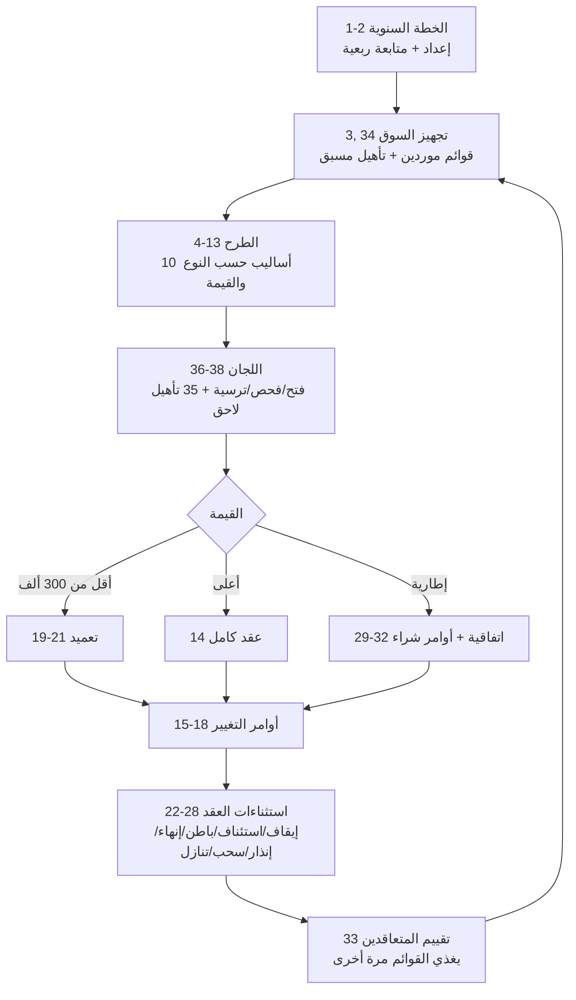

# تحليل تفصيلي — دليل إجراءات العمل للإدارة العامة للمشتريات (الهيئة العامة للطرق)

> **المصدر:** `RGA-دليل-اجراءات-العمل-للادارة-العامة-للمشتريات.pdf` (134 صفحة، 38 إجراء عمل).
> **الجهة:** الهيئة العامة للطرق (Roads General Authority)، الرياض.
> **تاريخ التحليل:** 2026-07-19. المخططات (flowcharts) داخل الـPDF صور غير قابلة للاستخراج؛
> منطق التفرع أُعيد بناؤه من جداول الأنشطة ("ملاحظات → رجوع للخطوة N").

---

## 1. القالب الموحد لكل إجراء

كل إجراء من الـ38 يتبع نفس البنية:

| القسم | المحتوى |
|---|---|
| **X.1 هيكلية الإجراء** | ترميز ثلاثي المستويات (X / X.1 / X.1.1) + بطاقة تعريف: الوصف، مالك الإجراء، الإجراء السابق/اللاحق، المدخلات، المخرجات، النماذج المستخدمة، الأنظمة الإلكترونية، مدة التنفيذ، **هل الإجراء مؤتمت (نعم/لا)**، **الحاجة إلى أتمتته (عالية/متوسطة/منخفضة)** |
| **X.2 مخطط الإجراء** | Flowchart (صورة) |
| **X.3 تفاصيل الأنشطة** | جدول: # / النشاط / الوصف / المسؤول عن التنفيذ / مدة التنفيذ / القناة أو الوسيلة |

- يوجد **نظام ترميز داخلي** بصيغة `QOL.P01.NNN` (وردت إحالات صريحة: `QOL.P01.08` من الإجراء 9 → الإجراء 8، و`QOL.P01.005` / `QOL.P01.035` للتأهيل اللاحق من الإجراءين 37/38).
- **الحاجة إلى الأتمتة = "عالية" في كل الإجراءات بلا استثناء**، ونحو نصفها "غير مؤتمت" أصلاً — الدليل نفسه مواصفة أتمتة.

## 2. الفهرس الكامل (38 إجراء)

| # | الإجراء | المالك | المدة | مؤتمت؟ |
|---|---|---|---|---|
| 1 | إعداد التخطيط المسبق (الخطة السنوية) | قسم الموردين | 36 يوم | لا |
| 2 | متابعة خطة الأعمال والمشتريات السنوية | إدارة الموردين | ربع سنوي | نعم |
| 3 | إنشاء إعلانات قوائم الموردين | إدارة الموردين | 10 أيام | نعم |
| 4 | الاتفاق المباشر بين الجهات الحكومية | إدارة المشتريات | 36 يوم | نعم |
| 5 | التعاقد مع المورد الوحيد / الكيان غير الربحي | إدارة المشتريات | 11 يوم | نعم |
| 6 | الأعمال والمشتريات في الحالات الطارئة | إدارة المشتريات | **5 أيام** | نعم |
| 7 | طرح الأعمال ≤ 30 ألف ريال | إدارة المشتريات | 9 أيام | نعم |
| 8 | **الطرح للمنافسات (المنافسة العامة)** | إدارة الطرح والمناقصات | 21 يوم | نعم |
| 9 | الطرح للمنافسة على مرحلتين | إدارة الطرح والمناقصات | 14 يوم | نعم |
| 10 | الطرح بالمزايدة العكسية الإلكترونية | إدارة الطرح والمناقصات | 21 يوم | لا |
| 11 | الطرح بأسلوب المسابقة | إدارة الطرح والمناقصات | 18 يوم | نعم |
| 12 | طرح الأعمال 30–100 ألف ريال | إدارة المشتريات | 9 أيام | نعم |
| 13 | طلب شراء **خارج خطة المشتريات** | إدارة الطرح والمناقصات | 13 يوم | لا |
| 14 | **إبرام وتسجيل العقود** | إدارة العقود | **53 يوم** | نعم |
| 15 | أوامر التغيير — بنود مماثلة | قسم العقود | 11 يوم | نعم |
| 16 | أوامر التغيير — بنود غير مماثلة | قسم العقود | 12 يوم | (غير محدد) |
| 17 | تغيير ممثل الجهة (مدير المشروع) | قسم العقود | 5 أيام | لا |
| 18 | تمديد مدة العقود (دون أثر مالي) | قسم العقود | 9 أيام | نعم |
| 19 | التعميد 100–300 ألف ريال | قسم العقود | 12 يوم | لا |
| 20 | التعميد 30–100 ألف ريال | قسم العقود | 10 أيام | نعم |
| 21 | التعميد ≤ 30 ألف ريال | قسم العقود | 11 يوم | نعم |
| 22 | إيقاف العقود | قسم العقود | 6 أيام | نعم |
| 23 | استئناف العقود | قسم العقود | 6 أيام | لا |
| 24 | التعاقد من الباطن | قسم العقود | 11 يوم | لا |
| 25 | إنهاء العقد | قسم العقود | 21 يوم | لا |
| 26 | إنذار المتعاقد | قسم العقود | 8 أيام | لا |
| 27 | السحب الجزئي والتنفيذ على حساب المتعاقد | قسم العقود | 10 أيام | لا |
| 28 | التنازل عن العقد | قسم العقود | 24 يوم | لا |
| 29 | إبرام الاتفاقيات الإطارية الخاصة بالهيئة | قسم العقود | 38 يوم | لا |
| 30 | أمر شراء من اتفاقية إطارية خاصة | قسم العقود | 13 يوم | لا |
| 31 | أمر شراء — شراء موحد (بدون عروض أسعار) | قسم العقود | 13 يوم | لا |
| 32 | أمر شراء — شراء موحد (بعروض أسعار) | قسم العقود | 12 يوم | لا |
| 33 | تقييم المتعاقدين | إدارة علاقات الموردين | 21 يوم | لا |
| 34 | التأهيل المسبق | إدارة علاقات الموردين | 18 يوم | لا |
| 35 | التأهيل اللاحق | إدارة علاقات الموردين | 12 يوم | لا |
| 36 | لجنة الشراء المباشر (فتح/فحص/ترسية) | الإدارة العامة للمشتريات | 14 يوم | لا |
| 37 | فتح وفحص العروض — **ملف واحد** | الإدارة العامة للمشتريات | 14 يوم | لا |
| 38 | فتح وفحص العروض — **ملفين منفصلين** | الإدارة العامة للمشتريات | 14 يوم | لا |

## 3. الطبقات الوظيفية (كيف تتركب دورة الحياة)

### 3.1 التخطيط (1–2)
- الخطة السنوية تُبنى من الميزانية المعتمدة → نموذج بيانات مشاريع لكل إدارة طالبة → دراسة وتحليل (فريق من 4 مديري إدارات: يحدد أسلوب الطرح، المخاطر، الموردين المحتملين، نوع العقد، الوفورات) → اعتماد تصاعدي حتى **الرئيس التنفيذي** → نشر على البوابة.
- متابعة ربعية: تقرير انحراف (المخطط مقابل الفعلي شهرياً)، وأي تحديث للخطة يتطلب موافقة صاحب صلاحية موثقة.

### 3.2 أساليب الطرح (4–13) — إجراء لكل أسلوب
كلها تبدأ بنفس النواة: **رفع طلب شراء (الإدارة الطالبة) → حجز ميزانية → تدقيق أخصائي المشتريات → سلسلة اعتماد → إنشاء بالبوابة → مُدخل التكلفة التقديرية (مظروف ورقي سري) → طرح → إشعار**، ثم تختلف الإضافات:

| الأسلوب | الخصوصية |
|---|---|
| 6 طوارئ | يشترط **موافقة الرئيس التنفيذي على تقرير الحالة الطارئة**؛ مسار مضغوط 5 أيام |
| 7 (≤30 ألف) | فحص **السوق الإلكتروني** أولاً لعدم وجود بند مماثل؛ قرار "دعوة من قائمة أم طرح عام" |
| 8 منافسة عامة | الأكمل (15 خطوة): تأهيل مسبق اختياري، اختيار **ملف/ملفين**، وعند **≥ 25 مليون** بوابة مراجعة خارجية (كفاءة الإنفاق + المحتوى المحلي، انتظار حتى 15 يوم) |
| 9 مرحلتين | مرحلة أولى عروض **بلا أسعار** (اقتراحات + حدود استرشادية غير ملزمة) → المجتازون يدخلون المرحلة الثانية عبر الإجراء 8 (`QOL.P01.08`) |
| 10 مزايدة عكسية | سلع جاهزة فقط، سقف **5 مليون**، إعلان ≥ 15 يوم، **≥ 3 متنافسين وإلا تُلغى**، شفافية ترتيب الأسعار بلا كشف هويات، الترسية على الأقل سعراً |
| 11 مسابقة | فائزون/مكافآت بحد أقصى 3؛ للجنة مقابلة مقدمي العروض |
| 13 خارج الخطة | **موافقة الرئيس التنفيذي** شرط دخول + رأي الميزانية عند عدم توفر سيولة يُضمَّن في وثائق المنافسة |

### 3.3 فحص العروض واللجان (36–38 + 34–35)
- **ملف واحد (37):** فتح فني+مالي معاً → تحليل فني (اللجنة أو الجهة الطالبة) → فحص مالي → تأهيل لاحق → محضر توصية → اعتماد صاحب الصلاحية → ترسية مبدئية فنهائية على البوابة → **فترة تظلم 5–10 أيام**.
- **ملفين (38):** الفرق الجوهري — **الملف المالي لا يُفتح إلا للعروض المطابقة فنياً** (الخطوتان 6–7)، وتُحدد المطابقة/عدم المطابقة على البوابة قبل فتح المالي.
- **تأهيل مسبق (34):** معايير معتمدة من كفاءة الإنفاق، نشر 30 يوم، رد على الاستفسارات خلال 10 أيام، محضر لجنة تأهيل.
- **تأهيل لاحق (35):** يوجَّه فقط **للمتنافس المجتاز فنياً ومالياً والمتوقع الترسية عليه**؛ إعلان ≤ 5 أيام عمل.
- قواعد نصاب اللجان: غياب الرئيس → النائب؛ غياب عضو → العضو الاحتياطي.

### 3.4 التعاقد (14، 19–21)
- **العقد الكامل (14) — 53 يوم، 21 خطوة:** إحالة وثائق → استلام محضر ترسية + أصل الضمان الابتدائي → إشعار ترسية → **فترة توقف** (تظلمات → لجنة مختصة) → ضمان نهائي (15 يوم + تمديد 15 بموافقة صاحب الصلاحية؛ فشل نهائي → **مصادرة الابتدائي والترسية على العرض التالي**) → مسودة عقد تُطابق خطاب الترسية → موافقات (ميزانية + قانونية) → إقرار جدول المعالم من المورد → **بوابتا وزارة المالية** (عرض العقد، ثم الإجازة الرأسمالية عند اللزوم — 15 يوم لكل رد) → توقيع المتعاقد (تأخر 15 يوم بعد إنذار → عرض مصادرة الضمان على اللجنة) → توقيع صاحب الصلاحية إلكترونياً → تحديث سجل العقود → توزيع (طالبة/مالية/رقابية) → أرشفة.
- **التعميد (19–21):** نفس الفكرة مصغّرة بثلاث شرائح مالية؛ شريحة ≤ 30 ألف تدمج الفحص والترسية داخل نفس الإجراء.

### 3.5 أوامر التغيير (15–18) — أربعة أنواع
| النوع | المسار المميز |
|---|---|
| 15 بنود مماثلة | مباشر: دراسة عقود → صاحب صلاحية → إشعار يعتمده **نائب الرئيس التنفيذي** |
| 16 بنود غير مماثلة | يُضاف **مرور إلزامي على اللجنة المختصة** (دراسة + محضر) قبل صاحب الصلاحية |
| 17 تغيير مدير المشروع | أخف مسار (7 خطوات، 5 أيام) |
| 18 تمديد بلا أثر مالي | مثل 16 (لجنة مختصة) لكن بلا ارتباط مالي |

قواعد مشتركة: الطلب **قبل نهاية العقد بـ30 يوم**، شرط سريان العقد وعدم الاستلام النهائي، المشروع الاستراتيجي يمر بمكتب إدارة المشاريع، الزيادة تتطلب ارتباطاً مالياً مسبقاً، وتمديد المدة يستتبع **تمديد الضمان النهائي** (دورة خطاب كاملة: إعداد → موافقة → اعتماد → إرسال).

### 3.6 استثناءات العقد (22–28)
- **إيقاف (22) / استئناف (23):** طلب الإيقاف قبل نهاية العقد بشهر على الأقل؛ الاستئناف يحسب **تعويض مدة الإيقاف** ويمدد العقد والضمان على البوابة.
- **باطن (24):** فحص ضد **المادة 14 من اللائحة التنفيذية**؛ ترخيص + تصنيف المقاول الباطن؛ **30–50% من قيمة العقد → موافقة مسبقة من كفاءة الإنفاق + إسناد لأكثر من مقاول باطن**؛ إقرار من المتعاقد الرئيس بالسماح بالصرف المباشر لمستحقات الباطن من مستحقاته.
- **إنهاء (25):** أربع حالات (وجوبي / جوازي / بالاتفاق / للمصلحة العامة)؛ قد يتضمن مصادرة الضمان والحجز على المستحقات؛ موافقة وزارة المالية على البوابة (15 يوم)؛ نسخة القرار إلى **لجنة النظر في مخالفات المتنافسين والمتعاقدين**.
- **إنذار (26) → سحب جزئي/تنفيذ على الحساب (27):** السحب بقرار رئيس الجهة أو مفوضه بتوصية لجنة؛ حجز على المستحقات بما لا يتجاوز قيمة الأعمال المنفذة على حسابه؛ طرح الأعمال المتبقية **بمنافسة محدودة بين أصحاب العروض التالية للفائز (≥ 3)** أو منافسة جديدة؛ محضر ميداني مشترك بحالة الموقع؛ عكس السحب على **منصة اعتماد** (مذكورة بالاسم).
- **تنازل (28):** اتفاقية تنازل مصدقة من الغرفة التجارية + شرط **عدم تنازل سابق خلال 3 سنوات** + تأهيل عيني للمتنازَل له + موافقة وزارة المالية + ملحق عقد بانتقال الالتزامات وضمان نهائي جديد.

### 3.7 الاتفاقيات الإطارية (29–32)
- **إبرام اتفاقية خاصة (29):** بعد الترسية وفترة التوقف → مسودة → **نموذج مراجعة وزارة المالية (15 يوم)** → عكس الاتفاقية على **السوق الإلكتروني** → توقيع (نفس جزاء الـ15 يوم للمتخلف).
- **أوامر الشراء:** من اتفاقية خاصة (30): مورد وحيد → مباشرة؛ عدة موردين → **منافسة مغلقة** بينهم. من الشراء الموحد عبر **منصة اكسبرو** بلا عروض (31) أو بعروض أسعار والترسية على الأقل سعراً (32). قيود إلغاء إلكتروني: تعديل خلال 5 أيام، اعتماد النموذج خلال 3 أيام.

### 3.8 تقييم المتعاقدين (33)
دورة تقييم بنموذج معتمد يملؤه مدير المشروع → اعتماد → إشعار المورد للتحسين → **أداء < 70% → رفع التقييم على البوابة + إحالة لإدارة العقود (إنذار/غرامات)** → عند نهاية التعاقد: متوسط أداء نهائي عبر كل عقود المورد مع الهيئة → **تحديث قائمة الموردين** (يغلق الدائرة مع الإجراء 3).

## 4. المصفوفات العرضية

### 4.1 العتبات المالية
| العتبة | الأثر |
|---|---|
| 30,000 ريال | حد الشراء المبسط (7، 21) |
| 100,000 ريال | فوقه: ضمان نهائي لأوامر الشراء (30–32)؛ وحد شريحة التعميد (12، 20) |
| 300,000 ريال | سقف التعميد — فوقه عقد كامل (19 مقابل 14) |
| 5,000,000 ريال | سقف المزايدة العكسية (10) |
| 25,000,000 ريال | مراجعة كفاءة الإنفاق + المحتوى المحلي قبل الطرح (8) |
| 30–50% من قيمة العقد | باطن: موافقة كفاءة الإنفاق + توزيع على أكثر من مقاول (24) |
| 70% أداء | عتبة الجزاءات في تقييم المتعاقدين (33) |

### 4.2 القواعد الزمنية المتكررة (SLAs)
| القاعدة | القيمة |
|---|---|
| تعديل ملاحظات الجهة الطالبة | 3 أيام عمل وإلا **يُلغى الطلب** (متكررة في 4، 5، 7، 8، 12، 13، 25، 27) |
| ملاحظات إدارة العقود على الكراسة | يومان (يوم واحد في الإجراءات الصغيرة) |
| طلب تغيير/إيقاف | قبل نهاية العقد بـ30 يوم |
| ضمان نهائي | 15 يوم + تمديد 15 يوم عمل بموافقة صاحب الصلاحية |
| تخلف عن توقيع العقد/الاتفاقية | إنذار ثم 15 يوم → عرض مصادرة الضمان على اللجنة |
| فترة التوقف/التظلم بعد الترسية | 5 أيام (وترد 5–10 أيام في 37/38) |
| رد وزارة المالية / اللجنة الرأسمالية / كفاءة الإنفاق | حتى 15 يوم لكل بوابة |
| نشر التأهيل المسبق | 30 يوم، رد على الاستفسارات خلال 10 أيام |
| إعلان التأهيل اللاحق | ≤ 5 أيام عمل |
| إلغاء إلكتروني (السوق الإلكتروني) | تعديل 5 أيام / اعتماد نموذج 3 أيام (31) |

### 4.3 سلاسل الاعتماد
- **القياسية:** إدارة طالبة → أخصائي (مشتريات/عقود) → مدير الإدارة → مدير عام الإدارة العامة للمشتريات → نائب الرئيس التنفيذي للخدمات المساندة → **صاحب الصلاحية**.
- **تصعيدات خاصة:** الرئيس التنفيذي (الخطة السنوية، الطوارئ، خارج الخطة)؛ نائب الرئيس التنفيذي (إشعارات أوامر التغيير)؛ اللجنة المختصة (بنود غير مماثلة، تمديد، إنهاء، سحب، تنازل، باطن).
- **الأدوار/الكيانات (~25):** أخصائي ومدير مشتريات، أخصائي ومدير عقود، أخصائي ومدير موردين، إدارة الطرح والمناقصات، مدير عام المشتريات، نائب الرئيس التنفيذي، الرئيس التنفيذي، صاحب الصلاحية، الإدارة الطالبة، مدير المشروع، مكتب إدارة المشاريع، الميزانية والتخطيط, الشؤون المالية والإدارية، الشؤون القانونية، المستودعات، **مُدخل التكلفة التقديرية** (دور مستقل — مظروف سري)، لجان: فتح العروض / فحص العروض (رئيس+نائب+أعضاء+احتياطي+سكرتير) / الشراء المباشر / التأهيل / الفنية بالجهة الطالبة / المزايدة العكسية / التظلمات / مخالفات المتنافسين.

### 4.4 الجهات الخارجية والتكاملات
| الجهة | نقاط الالتقاء |
|---|---|
| **منصة اعتماد** ("البوابة الإلكترونية" + "السوق الإلكتروني"؛ بالاسم في إجراء 27) | الطرح، العروض، الترسية، العقود، التعميد، أوامر التغيير، السحب، تقييم الأداء |
| **وزارة المالية** | عرض العقود، الإجازة الرأسمالية (لجنة الرأسمالية)، مراجعة الاتفاقيات الإطارية، الإنهاء، التنازل |
| **هيئة كفاءة الإنفاق (اكسبرو)** | نماذج تشغيلية معتمدة، مراجعة ≥ 25 مليون، بنود الاستثناء، معايير التأهيل، الشراء الموحد، موافقة الباطن 30–50% |
| هيئة المحتوى المحلي / هيئة الحكومة الرقمية | آليات المحتوى المحلي والمتطلبات الرقمية ضمن قائمة تحقق الكراسة |
| المادة 14 من اللائحة التنفيذية | فحص أهلية مقاول الباطن (المرجع النظامي الصريح الوحيد بالنص) |

## 5. الإسقاط على تنفيذ

| ما في الدليل | المقابل في تنفيذ |
|---|---|
| كل خطوة "ملاحظات → رجوع للخطوة N" باعتماد مسؤول محدد | R-01/R-02: gated audited workflow transitions — محرك الـworkflow هو المنتج المطلوب حرفياً |
| سلسلة الاعتماد القياسية + التصعيدات | RBAC (R-04) + approval chains القابلة للتهيئة |
| إجراء 37 (ملف واحد) / 38 (ملفين) | **BR-01** وطريقة تقديم العروض في نموذج الكراسة |
| إجراءات 1–2 (خطة + انحراف) و13 (خارج الخطة) | موديول الخطة السنوية المبني فعلاً (plans/items/out-of-plan/behind-plan) |
| بطاقة كل إجراء (مدخلات/مخرجات/نماذج/مدد) | مواصفة جاهزة لحقول النماذج وSLAs المؤقتات في محرك القواعد |
| اعتماد/المالية/اكسبرو كبوابات انتظار خارجية | R-08 (مصدر الحقيقة) + حالات انتظار برد خارجي وmohla متابعة |
| 33 (تقييم ≥/< 70%) | حلقة تقييم المتعاقدين ↔ قوائم الموردين |
| "الحاجة للأتمتة: عالية" في كل إجراء + مظروف التكلفة الورقي السري | حجة البيع المباشرة: الدليل يوثق الألم بنفسه |

## 6. ملاحظات على الوثيقة نفسها (فجوات)

- لا يوجد فهرس محتويات؛ صفحات المخططات صور غير مستخرجة (المنطق موثق نصياً فقط).
- أخطاء ترقيم داخلية في إحالات بعض الجداول (مثل الإجراء 20: بنود مكررة 16–17؛ إحالات خطوات غير متسقة في 19 و26).
- خانة "مؤتمت" فارغة في الإجراء 16؛ حقل النماذج في الإجراء 38 يذكر "محضر فحص عروض الشراء المباشر" (خطأ نسخ ظاهر).
- المرجع النظامي الوحيد الصريح بالمادة هو المادة 14 من اللائحة؛ بقية الأحكام (فترة التوقف، المزايدة العكسية، التأهيل...) منسوخة من النظام دون استشهاد.
